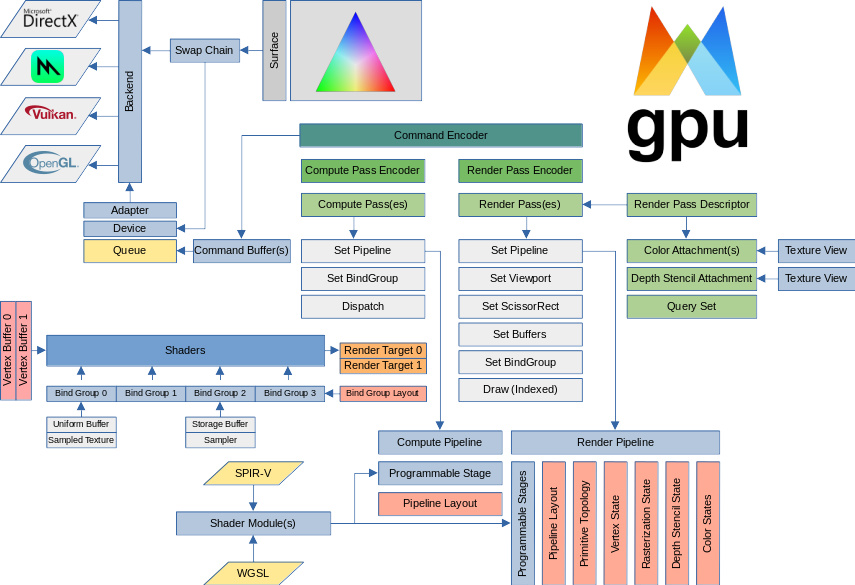

# WebGPU Native Examples and Demos

[WebGPU](https://gpuweb.github.io/gpuweb/) is a new graphics and compute API designed by the [“GPU for the Web”](https://www.w3.org/community/gpu/) W3C community group. It aims to provide modern features such as “GPU compute” as well as lower overhead access to GPU hardware and better, more predictable performance. WebGPU should work with existing platform APIs such as Direct3D 12 from Microsoft, Metal from Apple, and Vulkan from the Khronos Group. 

WebGPU is designed for the Web, used by JavaScript and WASM applications, and driven by the shared principles of Web APIs. However, it doesn’t have to be only for the Web though. Targeting WebGPU on native enables to write extremely portable and fairly performant graphics applications. The WebGPU API is beginner friendly, meaning that the API automates some of the aspects of low-level graphics APIs which have high complexity but low return on investment. It still has the core pieces of the next-gen APIs, such as command buffers, render passes, pipeline states and layouts. Because the complexity is reduced, users will be able to direct more focus towards writing efficiently application code.

From the very beginning, Google had both native and in-browser use of their implementation, which is now called [Dawn](https://dawn.googlesource.com/dawn). Mozilla has a shared interest in allowing developers to target a shared “WebGPU on native” target instead of a concrete “Dawn” or “[wgpu-native](https://github.com/gfx-rs/wgpu-native)”. This is achieved, by a [shared header](https://github.com/webgpu-native/webgpu-headers), and C-compatible libraries implementing it. However, this specification is still a moving target.



This repository contains a collection of open source C examples for [WebGPU](https://gpuweb.github.io/gpuweb/) using [Dawn](https://dawn.googlesource.com/dawn) the open-source and cross-platform implementation of the work-in-progress [WebGPU](https://gpuweb.github.io/gpuweb/) standard. 

## Supported Platforms

*  GNU/Linux

## Get the Sources

This repository contains submodules for external dependencies, so when doing a fresh clone you need to clone recursively:

```
$ git clone --recursive https://github.com/samdauwe/webgpu-native-examples.git
```

Existing repositories can be updated manually:

```bash
$ git submodule init
$ git submodule update
```

## Building for native with Dawn

The examples are built on top of [Dawn](https://dawn.googlesource.com/dawn), an open-source and cross-platform implementation of the work-in-progress WebGPU standard.

### GNU/Linux

A helper bash script was created to fetch the latest version of "[depot_tools](http://commondatastorage.googleapis.com/chrome-infra-docs/flat/depot_tools/docs/html/depot_tools_tutorial.html#_setting_up)" and "[Dawn](https://dawn.googlesource.com/dawn)". With this approach only the Dawn code base is fetched in order to build the WebGPU implementation using [CMake](https://cmake.org/) and without using the Chromium build system and dependency management.

The first step into building the WebGPU examples is running this script as follows:

```bash
$ cd external/dawn
$ bash download_dawn.sh
```

Note: running this script takes a while as it needs to pull several Gigabytes of dependencies from the internet.

The second step is building the examples:

```bash
$ mkdir build
$ cd build
$ cmake ..
$ make all
```

### Docker container

To build and run the examples inside a [Docker](https://www.docker.com/) container, follow the steps as described below.

Build the Docker image:

```bash
$ bash ./build.sh -docker_build
```

Run the Docker container:

```bash
$ bash ./build.sh -docker_run
```

Once the docker container is running, update to the latest version of "depot_tools" and "Dawn":

```bash
$ bash ./build.sh -update_dawn
```

Note: The build toolchain from depot_tools will not be used for building Dawn. Therefore, if this steps fails when extracting the build toolchains (i.e. debian_sid_i386_sysroot.tar.xz) and you see an error similar to this:

```
tar: .: Cannot change ownership to uid 416578, gid 89939: Invalid argument
```

then just ignore this error, because the required Dawn source code is already fetched at this point.

Finally, build the samples

```bash
$ bash ./build.sh -webgpu_native_examples
```

## Running the examples

### Linux

The build step described in the previous section creates a subfolder "x64" in the build folder. This subfolder contains all libraries and assets needed to run examples. Instead of a separate executable for each different example, a different approach was chosen to create an example launcher. This launcher can be used as follows, "./wgpu_sample_launcher <example_name>" where <example_name> is the filename of the example without the extension, like for example:

```bash
$ ./wgpu_sample_launcher shadertoy
```

## Project Layout

```bash
├─ 📂 assets/         # Assets (models, textures, shaders, etc.)
├─ 📂 doc/            # Documentation files
│  └─ 📁 images         # WebGPU diagram, logo
├─ 📂 docker/         # Contains the Dockerfile for building Docker image
├─ 📂 external/       # Dependencies dependencies
│  ├─ 📁 cglm           # Highly Optimized Graphics Math (glm) for C
│  ├─ 📁 dawn           # WebGPU implementation
│  └─ 📁 ...            # Other Dependencies (cgltf, cimgui, stb, etc.)
├─ 📂 lib/            # Custom libraries
│  └─ 📁 wgpu_native    # Helper functions using the Dawn C++ API exposed as C API
├─ 📂 screenshots/    # Contains screenshots for each functional example
├─ 📂 src/            # Helper functions and examples source code
│  ├─ 📁 core           # Base functions (input, camera, logging, etc.)
│  ├─ 📁 examples       # Examples source code, each example is located in a single file
│  ├─ 📁 platforms      # Platform dependent functionality (input handling, window creation, etc.)
│  ├─ 📁 webgpu         # WebGPU related helper functions (buffers & textures creation, etc.)
│  └─ 📄 main.c         # Example launcher main source file
├─ 📄 .clang-format   # Clang-format file for automatically formatting C code
├─ 📄 .gitmodules     # Used Git submodules
├─ 📄 .gitignore      # Ignore certain files in git repo
├─ 📄 build.sh        # bash script to automate different aspects of the build process
├─ 📄 CMakeLists.txt  # CMake build file
├─ 📄 LICENSE         # Repository License (Apache-2.0 License)
└─ 📃 README.md       # Read Me!
```

## Examples

### Basics

#### [Clear screen](src/examples/clear_screen.c)

This example shows how to set up a swap chain and clearing the screen. The screen clearing animation shows a fade-in and fade-out effect.

#### [Coordinate system](src/examples/coordinate_system.c)

Illustrates the coordinate systems used in WebGPU. WebGPU’s coordinate systems match DirectX and Metal’s coordinate systems in a graphics pipeline. Y-axis is up in normalized device coordinate (NDC): point(-1.0, -1.0) in NDC is located at the bottom-left corner of NDC. This example has several options for changing relevant pipeline state, and displaying meshes with WebGPU or Vulkan style coordinates.

#### [Triangle](src/examples/triangle.c)

Basic and verbose example for getting a colored triangle rendered to the screen using WebGPU. This is meant as a starting point for learning WebGPU from the ground up.

#### [Two cubes](src/examples/two_cubes.c)

This example shows some of the alignment requirements involved when updating and binding multiple slices of a uniform buffer.

#### [Bind groups](src/examples/bind_groups.c)

Bind groups are used to pass data to shader binding points. This example sets up bind groups & layouts, creates a single render pipeline based on the bind group layout and renders multiple objects with different bind groups.

#### [Dynamic uniform buffers](src/examples/dynamic_uniform_buffer.c)

Dynamic uniform buffers are used for rendering multiple objects with multiple matrices stored in a single uniform buffer object. Individual matrices are dynamically addressed upon bind group binding time, minimizing the number of required bind groups.

#### [Texture mapping](src/examples/textured_quad.c)

Loads a 2D texture from disk (including all mip levels), uses staging to upload it into video memory and samples from it using combined image samplers.

#### [Textured cube](src/examples/textured_cube.c)

This example shows how to bind and sample textures.

#### [Cube map textures](src/examples/skybox.c)

Loads a cube map texture from disk containing six different faces. All faces and mip levels are uploaded into video memory, and the cubemap is displayed on a skybox as a backdrop and on a 3D model as a reflection.

#### [3D textures](src/examples/texture_3d.c)

Generates a 3D texture on the cpu (using perlin noise), uploads it to the device and samples it to render an animation. 3D textures store volumetric data and interpolate in all three dimensions.

#### [Equirectangular panorama](src/examples/equirectangular_image.c)

This example shows how to render an equirectangular panorama consisting of a single rectangular image. The equirectangular input can be used for a 360 degrees viewing experience to achieve more realistic surroundings and convincing real-time effects.

#### [Reversed Z](src/examples/reversed_z.c)

This example shows the use of reversed z technique for better utilization of depth buffer precision. The left column uses regular method, while the right one uses reversed z technique. Both are using depth32float as their depth buffer format. A set of red and green planes are positioned very close to each other. Higher sets are placed further from camera (and are scaled for better visual purpose). To use  reversed z to render your scene, you will need depth store value to be 0.0, depth compare function to be greater, and remap depth range by multiplying an additional matrix to your projection matrix.

#### [Conservative rasterization](src/examples/conservative_raster.c)

This example shows how to render with conservative rasterization (native extension with limited support).

When enabled, any pixel touched by a triangle primitive is rasterized. This is useful for various advanced techniques, most prominently for implementing realtime voxelization.

The demonstration here is implemented by rendering a triangle to a low-resolution target and then upscaling it with nearest-neighbor filtering. The outlines of the triangle are then rendered in the original solution, using the same vertex shader as the triangle. Pixels only drawn with conservative rasterization enabled are colored red.

Note: Conservative rasterization not supported in Google Dawn.

#### [Wireframe and Thick-Line Rendering](src/examples/wireframe_vertex_pulling.c)

This example shows how to render a single indexed triangle model as mesh, wireframe, or wireframe with thick lines, without the need to generate additional buffers for line rendering.

Uses <a href="https://xeolabs.com/pdfs/OpenGLInsights.pdf">vertex pulling</a> to let the vertex shader decide which vertices to load, which allows us to render indexed triangle meshes as wireframes or even thick-wireframes.

<ul>
    <li>
        A normal wireframe is obtained by drawing 3 lines (6 vertices) per triangle.
        The vertex shader then uses the index buffer to load the triangle vertices in the order in which we need them to draw lines.
    </li>
    <li>
        A thick wireframe is obtained by rendering each of the 3 lines of a triangle as a quad (comprising 2 triangles).
        For each triangle of the indexed model, we are drawing a total of 3 lines/quads = 6 triangles = 18 vertices.
        Each of these 18 vertices belongs to one of three lines, and each vertex shader invocation loads the start and end of the corresponding line. The line is then projected to screen space, and the orthogonal of the screen-space line direction is used to shift the vertices of each quad into the appropriate directions to obtain a thick line.
    </li>
</ul>

#### [Offscreen rendering](src/examples/offscreen_rendering.c)

Basic offscreen rendering in two passes. First pass renders the mirrored scene to a separate framebuffer with color and depth attachments, second pass samples from that color attachment for rendering a mirror surface.

#### [Stencil buffer](src/examples/stencil_buffer.c)

Uses the stencil buffer and its compare functionality for rendering a 3D model with dynamic outlines.

### glTF

These samples show how implement different features of the [glTF 2.0 3D format](https://www.khronos.org/gltf/) 3D transmission file format in detail.

#### [glTF model loading and rendering](src/examples/gltf_loading.c)

Shows how to load a complete scene from a [glTF 2.0](https://github.com/KhronosGroup/glTF) file. The structure of the glTF 2.0 scene is converted into the data structures required to render the scene with WebGPU.

#### [glTF scene rendering](src/examples/gltf_scene_rendering.c)

Renders a complete scene loaded from an [glTF 2.0](https://github.com/KhronosGroup/glTF) file. The sample uses the glTF model loading functions, and adds data structures, functions and shaders required to render a more complex scene using [Crytek's Sponza model](https://casual-effects.com/data/) with per-material pipelines and normal mapping.

### Advanced

#### [MSAA line](src/examples/msaa_line.c)

This example shows how to achieve [multisample anti-aliasing](https://en.wikipedia.org/wiki/Multisample_anti-aliasing)(MSAA) in WebGPU. The render pipeline is created with a sample count > 1. A new texture with a sample count > 1 is created and set as the color attachment instead of the swapchain. The swapchain is now specified as a resolve_target.

#### [Multi sampling](src/examples/multi_sampling.c)

Implements multisample anti-aliasing (MSAA) using a renderpass with multisampled attachments that get resolved into the visible frame buffer.

#### [High dynamic range](src/examples/hdr.c)

Implements a high dynamic range rendering pipeline using 16/32 bit floating point precision for all internal formats, textures and calculations, including a bloom pass, manual exposure and tone mapping.

#### [Cube reflection](src/examples/cube_reflection.c)

This example shows how to create a basic reflection pipeline.

#### [Shadow mapping](src/examples/shadow_mapping.c)

This example shows how to sample from a depth texture to render shadows from a directional light source.

#### [Run-time mip-map generation](src/examples/texture_mipmap_gen.c)

Generating a complete mip-chain at runtime instead of loading it from a file, by blitting from one mip level, starting with the actual texture image, down to the next smaller size until the lower 1x1 pixel end of the mip chain.

#### [Capturing screenshots](src/examples/screenshot.c)

This example shows how to capture an image by rendering a scene to a texture, copying the texture to a buffer, and retrieving the image from the buffer so that it can be stored into a png image. Two render pipelines are used in this example: one for rendering the scene in a window and another pipeline for offscreen rendering. Note that a single offscreen render pipeline would be sufficient for "taking a screenshot," with the added benefit that this method would not require a window to be created.

### Performance

#### [Instancing](src/examples/instanced_cube.c)

Uses the instancing feature for rendering (many) instances of the same mesh from a single vertex buffer with variable parameters.

#### [Occlusion queries](src/examples/occlusion_query.c)

Demonstrated how to use occlusion queries to get the number of fragment samples that pass all the per-fragment tests for a set of drawing commands.

### Physically Based Rendering

Physical based rendering as a lighting technique that achieves a more realistic and dynamic look by applying approximations of bidirectional reflectance distribution functions based on measured real-world material parameters and environment lighting.

#### [PBR basics](src/examples/pbr_basic.c)

Demonstrates a basic specular BRDF implementation with solid materials and fixed light sources on a grid of objects with varying material parameters, demonstrating how metallic reflectance and surface roughness affect the appearance of pbr lit objects.

### Deferred

These examples use a [deferred shading](https://en.wikipedia.org/wiki/Deferred_shading) setup.

#### [Deferred rendering basics](src/examples/deferred_rendering.c)

Shows how to do deferred rendering with WebGPU. Renders geometry info to multiple targets in the gBuffers in the first pass. In this sample, 3 gBuffers are used for positions, normals, and albedo. In a second pass, the lighting is calculated with per fragment data read from gBuffers so it's independent of scene complexity. Light positions are updated in a compute shader, where further operations like tile/cluster culling could happen.

### Compute Shader

#### [Animometer](src/examples/animometer.c)

A WebGPU of port of the Animometer MotionMark benchmark.

#### [Compute boids](src/examples/compute_boids.c)

A GPU compute particle simulation that mimics the flocking behavior of birds. A compute shader updates two ping-pong buffers which store particle data. The data is used to draw instanced particles.

#### [Image blur](src/examples/image_blur.c)

This example shows how to blur an image using a compute shader.

#### [Image processing](src/examples/compute_shader.c)

Uses a compute shader to apply different convolution kernels (and effects) on an input image in realtime.

#### [GPU particle system](src/examples/compute_particles.c)

Attraction based 2D GPU particle system using compute shaders. Particle data is stored in a shader storage buffer and only modified on the GPU using compute particle updates with graphics pipeline vertex access.

#### [GPU particle system easing](src/examples/compute_particles_easing.c)

Particle system using compute shaders. Particle data is stored in a shader storage buffer, particle movement is implemented using easing functions.

#### [N-body simulation](src/examples/n_body_simulation.c)

A simple N-body simulation based particle system implemented using WebGPU.

#### [Ray tracing](src/examples/compute_ray_tracing.c)

Simple GPU ray tracer with shadows and reflections using a compute shader. No scene geometry is rendered in the graphics pass.

### User Interface

#### [Text rendering](src/examples/text_overlay.c)

Load and render a 2D text overlay created from the bitmap glyph data of a [stb font file](https://nothings.org/stb/font/). This data is uploaded as a texture and used for displaying text on top of a 3D scene in a second pass.

#### [ImGui overlay](src/examples/imgui_overlay.c)

Generates and renders a complex user interface with multiple windows, controls and user interaction on top of a 3D scene. The UI is generated using [Dear ImGUI](https://github.com/ocornut/imgui) and updated each frame.

### Effects

#### [Fullscreen radial blur](src/examples/radial_blur.c)

Demonstrates the basics of fullscreen shader effects. The scene is rendered into an offscreen framebuffer at lower resolution and rendered as a fullscreen quad atop the scene using a radial blur fragment shader.

#### [Bloom](src/examples/bloom.c)

Advanced fullscreen effect example adding a bloom effect to a scene. Glowing scene parts are rendered to a low res offscreen framebuffer that is applied atop the scene using a two pass separated gaussian blur.

#### [Parallax mapping](src/examples/parallax_mapping.c)

Implements multiple texture mapping methods to simulate depth based on texture information: Normal mapping, parallax mapping, steep parallax mapping and parallax occlusion mapping (best quality, worst performance).

### Misc

#### [WebGPU Gears](src/examples/gears.c)

WebGPU interpretation of [glxgears](https://linuxreviews.org/Glxgears). Procedurally generates and animates multiple gears.

#### [Video uploading](src/examples/video_uploading.c)

This example shows how to upload video frames to WebGPU. Uses [FFmpeg](https://www.ffmpeg.org/) for the video decoding.

#### [Immersive video](src/examples/immersive_video.c)

This example shows how to display a 360-degree video where the viewer has control of the viewing direction. Uses [FFmpeg](https://www.ffmpeg.org/) for the video decoding.

#### [Shadertoy](src/examples/video_uploading.c)

Minimal "shadertoy launcher" using WebGPU, demonstrating how to load an example Shadertoy shader '[Cube lines](https://www.shadertoy.com/view/NslGRN)'.

#### [Gerstner Waves](src/examples/gerstner_waves.c)

WebGPU implementation of the [Gerstner Waves algorithm](https://en.wikipedia.org/wiki/Trochoidal_wave). This example has been ported from [this JavaScript implementation](https://github.com/artemhlezin/webgpu-gerstner-waves) to native code.

#### [Terrain Mesh](src/examples/terrain_mesh.c)

This example shows how to render an infinite landscape for the camera to meander around in. The terrain consists of a tiled planar mesh that is displaced with a heightmap. More technical details can be found on [this page](https://metalbyexample.com/webgpu-part-two/) and [this one](https://blogs.igalia.com/itoral/2016/10/13/opengl-terrain-renderer-rendering-the-terrain-mesh/).

#### [Pseudorandom number generation (PRNG)](src/examples/prng.c)

A WebGPU example demonstrating pseudorandom number generation on the GPU. A [32-bit PCG hash](https://www.reedbeta.com/blog/hash-functions-for-gpu-rendering/) is used which is fast enough to be useful for real-time, while also being high-quality enough for almost any graphics use-case.

## Dependencies

Just like all software, WebGPU Native Examples and Demos are built on the shoulders of incredible people! Here's a list of the used libraries.

### System ###

* [CMake](https://cmake.org) (>= 3.17)
* [FFmpeg](https://www.ffmpeg.org/) used for video decoding (optional)

### Available as git submodules ###

* [cglm](https://github.com/recp/cglm): Highly Optimized Graphics Math (glm) for C.
* [cgltf](https://github.com/jkuhlmann/cgltf): Single-file glTF 2.0 loader and writer written in C99.
* [cimgui](https://github.com/cimgui/cimgui): c-api for [Dear ImGui](https://github.com/ocornut/imgui)
* [ktx](https://github.com/KhronosGroup/KTX-Software): KTX (Khronos Texture) Library and Tools
* [rply](http://w3.impa.br/~diego/software/rply/): ANSI C Library for PLY file format input and output
* [stb](https://github.com/nothings/stb): stb single-file public domain libraries for C/C++

## Credits

A huge thanks to the authors of the following repositories who demonstrated the use of the [WebGPU API](https://webgpu.dev/) and how to create a minimal example framework:
* [wgpu-rs](https://github.com/gfx-rs/wgpu-rs)
* [webgpu-samples](https://github.com/austinEng/webgpu-samples)
* [Vulkan C++ examples and demos](https://github.com/SaschaWillems/Vulkan)
* [Awesome WebGPU](https://github.com/mikbry/awesome-webgpu)
* [Markus Schütz](https://github.com/m-schuetz) ([@m_schuetz](https://twitter.com/m_schuetz))

## References

* [WebGPU - Chrome Platform Status](https://chromestatus.com/feature/6213121689518080#details)
* [Changelog for WebGPU in Chromium / Dawn 94](https://t.co/s87U4pi4tr)
* [Changelog for WebGPU in Chromium / Dawn 96](https://t.co/v9SFkmQAWw)
* [Changelog for WebGPU in Chromium / Dawn 98](https://t.co/fS1NR5bog0)

## Roadmap: January - April 2022

The list given below summarizes possible examples or functionality that will be added in the next 3-4 months.

* [ ] [Square](https://github.com/cx20/webgpu-test/tree/master/examples/webgpu_wgsl/square)
* [ ] [High Dynamic Range Rendering](https://github.com/SaschaWillems/Vulkan/tree/master/examples/hdr)
* [ ] [glTF vertex skinning](https://github.com/SaschaWillems/Vulkan/tree/master/examples/gltfskinning)
* [ ] [Aquarium](https://github.com/webatintel/aquarium)
* [ ] [Physically-Based Rendering using glTF 2.0 models](https://github.com/SaschaWillems/Vulkan-glTF-PBR)
* [ ] Building for Web with Emscripten / WebAssembly
* [ ] Resolve glTF model rendering / loading issues showing up in a couple of example

## License

Open-source under [Apache 2.0 license](http://www.tldrlegal.com/license/apache-license-2.0-%28apache-2.0%29).