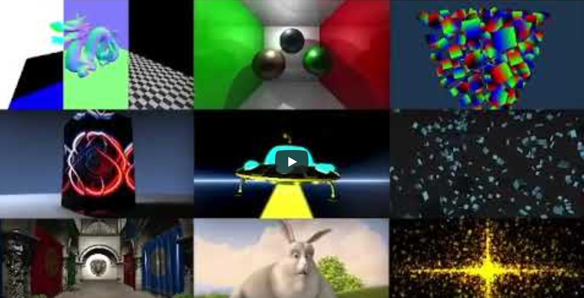

# WebGPU Native Examples and Demos

[WebGPU](https://gpuweb.github.io/gpuweb/) is a new graphics and compute API designed by the [“GPU for the Web”](https://www.w3.org/community/gpu/) W3C community group. It aims to provide modern features such as “GPU compute” as well as lower overhead access to GPU hardware and better, more predictable performance. WebGPU should work with existing platform APIs such as Direct3D 12 from Microsoft, Metal from Apple, and Vulkan from the Khronos Group. 

WebGPU is designed for the Web, used by JavaScript and WASM applications, and driven by the shared principles of Web APIs. However, it doesn't have to be only for the Web. Targeting WebGPU on native enables writing extremely portable and fairly performant graphics applications. The WebGPU API is beginner friendly, meaning that the API automates some of the aspects of low-level graphics APIs which have high complexity but low return on investment. It still has the core pieces of the next-gen APIs, such as command buffers, render passes, pipeline states and layouts. Because the complexity is reduced, users will be able to direct more focus towards writing efficient application code.

From the very beginning, Google had both native and in-browser use of their implementation, which is now called [Dawn](https://dawn.googlesource.com/dawn). Mozilla has a shared interest in allowing developers to target a shared “WebGPU on native” target instead of a concrete “Dawn” or “[wgpu-native](https://github.com/gfx-rs/wgpu-native)”. This is achieved, by a [shared header](https://github.com/webgpu-native/webgpu-headers), and C-compatible libraries implementing it. However, this specification is still a moving target.


This repository contains a collection of open source C examples for [WebGPU](https://gpuweb.github.io/gpuweb/) using [Dawn](https://dawn.googlesource.com/dawn) the open-source and cross-platform implementation of the work-in-progress [WebGPU](https://gpuweb.github.io/gpuweb/) standard.

[](https://youtu.be/64MP1a7qZK0 "WebGPU Native Examples and Demos")

## Table of Contents

+ [Supported Platforms](#Supported-Platforms)
+ [Get the Sources](#Get-the-Sources)
+ [Building for native with Dawn](#Building-for-native-with-Dawn)
+ [Running the examples](#Running-the-examples)
+ [Project Layout](#Project-Layout)
+ [Examples](#Examples)
    + [Basics](#Basics)
    + [glTF](#glTF)
    + [Advanced](#Advanced)
    + [Performance](#Performance)
    + [Physically Based Rendering](#Physically-Based-Rendering)
    + [Deferred](#Deferred)
    + [Compute Shader](#Compute-Shader)
    + [User Interface](#User-Interface)
    + [Effects](#Effects)
    + [Misc](#Misc)
+ [Dependencies](#Dependencies)
+ [Credits](#Credits)
+ [References](#References)
+ [Roadmap](#Roadmap)
+ [License](#License)

## Supported Platforms

*  GNU/Linux

## Get the Sources

This repository contains submodules for external dependencies, so when doing a fresh clone you need to clone recursively:

```
$ git clone --recursive https://github.com/samdauwe/webgpu-native-examples.git
```

Existing repositories can be updated manually:

```bash
$ git submodule update --init
```

## Building for native with Dawn

The examples are built on top of [Dawn](https://dawn.googlesource.com/dawn), an open-source and cross-platform implementation of the work-in-progress WebGPU standard.

### GNU/Linux

Build the examples using the following commands:

```bash
$ cmake -B build && cmake --build build -j4
```

### Docker container

To build and run the examples inside a [Docker](https://www.docker.com/) container, follow the steps as described below.

Build the Docker image:

```bash
$ bash ./build.sh -docker_build
```

Run the Docker container:

```bash
$ bash ./build.sh -docker_run
```

Finally, build the samples

```bash
$ bash ./build.sh -webgpu_native_examples
```

## Running the examples

### Linux

The build step described in the previous section creates a subfolder "x64" in the build folder. This subfolder contains all libraries and assets needed to run examples. A separate executable is created for each different example.

```bash
$ ./hello_triangle
```

## Project Layout

```bash
├─ 📂 assets/         # Assets (models, textures, shaders, etc.)
├─ 📂 doc/            # Documentation files
│  └─ 📁 images         # WebGPU diagram, logo
├─ 📂 docker/         # Contains the Dockerfile for building Docker image
├─ 📂 external/       # Dependencies
│  ├─ 📁 cglm           # Highly Optimized Graphics Math (glm) for C
│  ├─ 📁 dawn           # WebGPU implementation
│  └─ 📁 ...            # Other Dependencies (cgltf, cimgui, stb, etc.)
├─ 📂 screenshots/    # Contains screenshots for each functional example
├─ 📂 src/            # Helper functions and examples source code
│  ├─ 📁 core           # Base functions (input, camera, logging, etc.)
│  ├─ 📁 examples       # Examples source code, each example is located in a single file
│  ├─ 📁 platforms      # Platform dependent functionality (input handling, window creation, etc.)
│  ├─ 📁 webgpu         # WebGPU related helper functions (buffers & textures creation, etc.)
│  └─ 📄 main.c         # Example launcher main source file
├─ 📄 .clang-format   # Clang-format file for automatically formatting C code
├─ 📄 .gitmodules     # Used Git submodules
├─ 📄 .gitignore      # Ignore certain files in git repo
├─ 📄 build.sh        # bash script to automate different aspects of the build process
├─ 📄 CMakeLists.txt  # CMake build file
├─ 📄 LICENSE         # Repository License (Apache-2.0 License)
└─ 📃 README.md       # Read Me!
```

## Examples

### Basics

#### [Clear screen](src/examples/clear_screen.c)

This example shows how to set up a swap chain and clearing the screen. The screen clearing animation shows a fade-in and fade-out effect.

#### [Coordinate system](src/examples/coordinate_system.c)

Illustrates the coordinate systems used in WebGPU. WebGPU’s coordinate systems match DirectX and Metal’s coordinate systems in a graphics pipeline. Y-axis is up in normalized device coordinate (NDC): point(-1.0, -1.0) in NDC is located at the bottom-left corner of NDC. This example has several options for changing relevant pipeline state, and displaying meshes with WebGPU or Vulkan style coordinates.

Render | Depth | Texture
-------|-------|--------
 |  | 

#### [Minimal](src/examples/minimal.c)

Minimalistic render pipeline demonstrating how to render a full-screen colored quad.

#### [Square](src/examples/square.c)

This example shows how to render a static colored square in WebGPU with only using vertex buffers.

#### [Triangle](src/examples/triangle.c)

Basic and verbose example for getting a colored triangle rendered to the screen using WebGPU. This is meant as a starting point for learning WebGPU from the ground up.

#### [Hello Triangle](src/examples/hello_triangle.c)

This example shows rendering a basic triangle.

#### [Two cubes](src/examples/two_cubes.c)

This example shows some of the alignment requirements involved when updating and binding multiple slices of a uniform buffer.

#### [Points](src/examples/points.c)

This example shows how to render points of various sizes using a quad and instancing. You can read more details [here](https://webgpufundamentals.org/webgpu/lessons/webgpu-points.html).

#### [Cameras](src/examples/cameras.c)

This example provides example camera implementations

#### [Dynamic uniform buffers](src/examples/dynamic_uniform_buffer.c)

Dynamic uniform buffers are used for rendering multiple objects with multiple matrices stored in a single uniform buffer object. Individual matrices are dynamically addressed upon bind group binding time, minimizing the number of required bind groups.

#### [Cubemap texture](src/examples/cubemap.c)

This example shows how to render and sample from a cubemap texture.

#### [Textured Cube](src/examples/textured_cube.c)

This example shows how to bind and sample textures.

#### [Equirectangular panorama](src/examples/equirectangular_image.c)

This example shows how to render an equirectangular panorama consisting of a single rectangular image. The equirectangular input can be used for a 360 degrees viewing experience to achieve more realistic surroundings and convincing real-time effects.

#### [Blending](src/examples/blending.c)

This example demonstrates the use of blending in WebGPU. It shows how to configure different blend operations, source factors, and destination factors for both color and alpha channels. The example displays two overlapping images with various blend modes that can be selected through a GUI.

#### [A-Buffer](src/examples/a_buffer.c)

This example demonstrates order independent transparency using a per-pixel linked-list of translucent fragments.

#### [Reversed Z](src/examples/reversed_z.c)

This example shows the use of reversed z technique for better utilization of depth buffer precision. The left column uses regular method, while the right one uses reversed z technique. Both are using depth32float as their depth buffer format. A set of red and green planes are positioned very close to each other. Higher sets are placed further from camera (and are scaled for better visual purpose). To use  reversed z to render your scene, you will need depth store value to be 0.0, depth compare function to be greater, and remap depth range by multiplying an additional matrix to your projection matrix.

#### [Sampler Parameters](src/examples/sampler_parameters.c)

Visualizes what all the sampler parameters do. Shows a textured plane at various scales (rotated, head-on, in perspective, and in vanishing perspective). The bottom-right view shows the raw contents of the 4 mipmap levels of the test texture (16x16, 8x8, 4x4, and 2x2).

#### [Wireframe and Thick-Line Rendering](src/examples/wireframe_vertex_pulling.c)

This example shows how to render a single indexed triangle model as mesh, wireframe, or wireframe with thick lines, without the need to generate additional buffers for line rendering.

Uses <a href="https://xeolabs.com/pdfs/OpenGLInsights.pdf">vertex pulling</a> to let the vertex shader decide which vertices to load, which allows us to render indexed triangle meshes as wireframes or even thick-wireframes.

<ul>
    <li>
        A normal wireframe is obtained by drawing 3 lines (6 vertices) per triangle.
        The vertex shader then uses the index buffer to load the triangle vertices in the order in which we need them to draw lines.
    </li>
    <li>
        A thick wireframe is obtained by rendering each of the 3 lines of a triangle as a quad (comprising 2 triangles).
        For each triangle of the indexed model, we are drawing a total of 3 lines/quads = 6 triangles = 18 vertices.
        Each of these 18 vertices belongs to one of three lines, and each vertex shader invocation loads the start and end of the corresponding line. The line is then projected to screen space, and the orthogonal of the screen-space line direction is used to shift the vertices of each quad into the appropriate directions to obtain a thick line.
    </li>
</ul>

#### [Wireframe](src/examples/wireframe.c)

This example demonstrates drawing a wireframe from triangles in 2 ways. Both use the vertex and index buffers as storage buffers and the use \`@builtin vertex_index)\` to index the vertex data. One method generates 6 vertices per triangle and uses line-list to draw lines. The other method draws triangles with a fragment shader that uses barycentric coordinates to draw edges as detailed [here](https://web.archive.org/web/20130424093557/http://codeflow.org/entries/2012/aug/02/easy-wireframe-display-with-barycentric-coordinates/).


#### [Out-of-bounds Viewport](src/examples/out_of_bounds_viewport.c)

WebGPU doesn't let you set the viewport’s values to be out-of-bounds. Therefore, the viewport’s values need to be clamped to the screen-size, which means the viewport values can’t be defined in a way that makes the viewport go off the screen. This example shows how to render a viewport out-of-bounds.

#### [Stencil mask](src/examples/stencil_mask.c)

Demonstrates using the stencil buffer for masking. It draws the 6 faces of a rotating cube into the stencil buffer, each with a different stencil value. Then it draws different scenes of animated objects where the stencil value matches, creating a cube-shaped window into different worlds.

### glTF

These samples show how implement different features of the [glTF 2.0 3D format](https://www.khronos.org/gltf/) 3D transmission file format in detail.

#### [Skinned mesh (GLTF skinning)](src/examples/skinned_mesh.c)

Demonstrates basic GLTF loading and mesh skinning, ported from [webgl-skinning](https://webgl2fundamentals.org/webgl/lessons/webgl-skinning.html). Mesh data, per-vertex attributes, and skin inverseBindMatrices are taken from the JSON parsed from the binary output of the .glb file. Animations are generated programmatically, with animated joint matrices updated and passed to shaders per frame via uniform buffers.

#### [Clustered Forward Shading](src/examples/clustered_shading.c)

A clustered forward shading renderer using WebGPU compute shaders for light culling, with PBR (Physically Based Rendering) materials loaded from the Sponza glTF scene. Uses a 32x18x48 cluster grid to efficiently assign up to 1024 lights to screen-space tiles, with configurable debug visualizations for depth, depth slices, cluster distances, and lights per cluster. Ported from [this JavaScript implementation](https://github.com/toji/webgpu-clustered-shading) to native code.

### Advanced

#### [MSAA line](src/examples/msaa_line.c)

This example shows how to achieve [multisample anti-aliasing](https://en.wikipedia.org/wiki/Multisample_anti-aliasing)(MSAA) in WebGPU. The render pipeline is created with a sample count > 1. A new texture with a sample count > 1 is created and set as the color attachment instead of the swapchain. The swapchain is now specified as a resolve_target.

#### [Cube reflection](src/examples/cube_reflection.c)

This example shows how to create a basic reflection pipeline.

#### [Shadow mapping](src/examples/shadow_mapping.c)

This example shows how to sample from a depth texture to render shadows from a directional light source.

#### [Primitive Picking](src/examples/primitive_picking.c)

This example demonstrates primitive picking by computing a primitive ID from vertex_index (since primitive_id builtin requires experimental extensions). Each primitive's unique ID is rendered to a texture, which is then read at the current cursor/touch location to determine which primitive has been selected. That primitive is highlighted in yellow when rendering the next frame.

### Performance

#### [Instancing](src/examples/instanced_cube.c)

Uses the instancing feature for rendering (many) instances of the same mesh from a single vertex buffer with variable parameters.


#### [Timestamp query](src/examples/timestamp_query.c)

This example demonstrates using Timestamp Queries to measure the duration of a render pass.

#### [Occlusion queries](src/examples/occlusion_query.c)

This example demonstrates using Occlusion Queries.

#### [Render bundles](src/examples/render_bundles.c)

This example shows how to use render bundles. It renders a large number of meshes individually as a proxy for a more complex scene in order to demonstrate the reduction in time spent to issue render commands. (Typically a scene like this would make use of instancing to reduce draw overhead.)

### Physically Based Rendering

Physical based rendering as a lighting technique that achieves a more realistic and dynamic look by applying approximations of bidirectional reflectance distribution functions based on measured real-world material parameters and environment lighting.

#### [PBR image based lighting](src/examples/gltf_pbr_ibl.c)

Adds image based lighting from an HDR environment cubemap to the PBR equation, using the surrounding environment as the light source. This adds an even more realistic look to the scene as the light contribution used by the materials is now controlled by the environment. Also shows how to generate the BRDF 2D-LUT and irradiance and filtered cube maps from the environment map.

#### [PBR image based lighting - OBJ Loader](src/examples/obj_pbr_ibl.c)

Physically Based Rendering with Image Based Lighting using OBJ model loader.

### Deferred

These examples use a [deferred shading](https://en.wikipedia.org/wiki/Deferred_shading) setup.

#### [Deferred rendering basics](src/examples/deferred_rendering.c)

This example shows how to do deferred rendering with webgpu. Render geometry info to multiple targets in the gBuffers in the first pass. In this sample we have 2 gBuffers for normals and albedo, along with a depth texture. And then do the lighting in a second pass with per fragment data read from gBuffers so it's independent of scene complexity. World-space positions are reconstructed from the depth texture and camera matrix. We also update light position in a compute shader, where further operations like tile/cluster culling could happen. The debug view shows the depth buffer on the left (flipped and scaled a bit to make it more visible), the normal G buffer in the middle, and the albedo G-buffer on the right side of the screen.

### Compute Shader

#### [Animometer](src/examples/animometer.c)

A WebGPU port of the Animometer MotionMark benchmark.

#### [Compute boids](src/examples/compute_boids.c)

A GPU compute particle simulation that mimics the flocking behavior of birds. A compute shader updates two ping-pong buffers which store particle data. The data is used to draw instanced particles.

#### [Image blur](src/examples/image_blur.c)

This example shows how to blur an image using a compute shader in WebGPU.

#### [Image processing](src/examples/compute_shader.c)

Uses a compute shader to apply different convolution kernels (and effects) on an input image in realtime.

#### [GPU particle system](src/examples/compute_particles.c)

Attraction based 2D GPU particle system using compute shaders. Particle data is stored in a shader storage buffer and only modified on the GPU using compute particle updates with graphics pipeline vertex access.

#### [GPU particle system easing](src/examples/compute_particles_easing.c)

Particle system using compute shaders. Particle data is stored in a shader storage buffer, particle movement is implemented using easing functions.

#### [GPU particle system - WebGPU logo](src/examples/compute_particles_webgpu_logo.c)

This example demonstrates rendering of particles simulated with compute shaders.

#### [N-body simulation](src/examples/n_body_simulation.c)

A simple N-body simulation based particle system implemented using WebGPU.

#### [Ray tracing](src/examples/compute_ray_tracing.c)

Simple GPU ray tracer with shadows and reflections using a compute shader. No scene geometry is rendered in the graphics pass.

#### [Cornell Box](src/examples/cornell_box.c)

A classic Cornell box, using a lightmap generated using software ray-tracing.

#### [Raytracer](src/examples/raytracer.c)

WebGPU demo featuring realtime path tracing via WebGPU compute shaders.

### User Interface

#### [Text rendering MSDF](src/examples/text_rendering_msdf.c)

This example uses multichannel signed distance fields (MSDF) to render text. MSDF fonts are more complex to implement than using Canvas 2D to generate text, but the resulting text looks smoother while using less memory than the Canvas 2D approach, especially at high zoom levels. They can be used to render larger amounts of text efficiently.

The font texture is generated using [Don McCurdy's MSDF font generation tool](https://msdf-bmfont.donmccurdy.com/), which is built on [Viktor Chlumský's msdfgen library](https://github.com/Chlumsky/msdfgen).

#### [ImGui overlay](src/examples/imgui_overlay.c)

Generates and renders a complex user interface with multiple windows, controls and user interaction on top of a 3D scene. The UI is generated using [Dear ImGUI](https://github.com/ocornut/imgui) and updated each frame.

### Effects

#### [Normal Mapping](src/examples/normal_map.c)

This example demonstrates multiple different methods that employ fragment shaders to achieve additional perceptual depth on the surface of a cube mesh. Demonstrated methods include normal mapping, parallax mapping, and steep parallax mapping.

#### [Post-processing](src/examples/post_processing.c)

This example shows how to use a post-processing effect to blend between two scenes. This example has been ported from [this JavaScript implementation](https://github.com/gnikoloff/webgpu-dojo/tree/master/src/examples/postprocessing-01) to native code.

### Misc

#### [WebGPU Gears](src/examples/gears.c)

WebGPU interpretation of [glxgears](https://linuxreviews.org/Glxgears). Procedurally generates and animates multiple gears.

#### [Video uploading](src/examples/video_uploading.c)

This example shows how to upload video frame to WebGPU.

giraffe by [Taryn Elliott](https://www.pexels.com/video/giraffe-walking-in-the-forest-5214261/).
lake by [Fabio Casati](https://commons.wikimedia.org/wiki/File:Video_360%C2%B0._Timelapse._Bled_Lake_in_Slovenia..webm), [CC BY 3.0](https://creativecommons.org/licenses/by/3.0)

#### [Shadertoy](src/examples/shadertoy.c)

Minimal "[Shadertoy](https://www.shadertoy.com/) launcher" using WebGPU, demonstrating how to load an example Shadertoy shader '[Seascape](https://www.shadertoy.com/view/Ms2SD1)'.

#### [Gerstner Waves](src/examples/gerstner_waves.c)

WebGPU implementation of the [Gerstner Waves algorithm](https://en.wikipedia.org/wiki/Trochoidal_wave). This example has been ported from [this JavaScript implementation](https://github.com/artemhlezin/webgpu-gerstner-waves) to native code.

#### [Terrain Mesh](src/examples/terrain_mesh.c)

This example shows how to render an infinite landscape for the camera to meander around in. The terrain consists of a tiled planar mesh that is displaced with a heightmap. More technical details can be found on [this page](https://metalbyexample.com/webgpu-part-two/) and [this one](https://blogs.igalia.com/itoral/2016/10/13/opengl-terrain-renderer-rendering-the-terrain-mesh/).

#### [Pseudorandom number generation (PRNG)](src/examples/prng.c)

A WebGPU example demonstrating pseudorandom number generation on the GPU. A [32-bit PCG hash](https://www.reedbeta.com/blog/hash-functions-for-gpu-rendering/) is used which is fast enough to be useful for real-time, while also being high-quality enough for almost any graphics use-case.

#### [Conway's Game of Life](src/examples/game_of_life.c)

This example shows how to make Conway's game of life. First, use compute shader to calculate how cells grow or die. Then use render pipeline to draw cells by using instance mesh.

#### [Conway Game Of Life](src/examples/conway.c)

A binary Conway [game of life](https://en.wikipedia.org/wiki/Conway%27s_Game_of_Life). This example has been ported from [this JavaScript implementation](https://github.com/Palats/webgpu/blob/main/src/demos/conway.ts) to native code.

#### [Conway Game Of Life With Paletted Blurring Over Time](src/examples/conway_paletted_blurring.c)

A conway [game of life](https://en.wikipedia.org/wiki/Conway%27s_Game_of_Life) with paletted blurring over time. This example has been ported from [this JavaScript implementation](https://github.com/Palats/webgpu/blob/main/src/demos/conway2.ts) to native code.

#### [Compute Metaballs](src/examples/compute_metaballs.c)

WebGPU demo featuring marching cubes and bloom post-processing via compute shaders, physically based shading, deferred rendering, gamma correction and shadow mapping. This example has been ported from [this TypeScript implementation](https://github.com/gnikoloff/webgpu-compute-metaballs) to native code. More implementation details can be found in [this blog post](https://archive.georgi-nikolov.com/project/webgpu-metaballs).

#### [Metaballs](src/examples/metaballs.c)

Real-time metaball rendering using marching cubes on the CPU, with tri-planar texture mapping on the GPU. Animated blobs that merge and split are rendered with selectable textures (lava, slime, water) inside a point-lit dungeon environment loaded from glTF, with instanced light sprites and an interactive orbit camera. This example has been ported from [this JavaScript implementation](https://github.com/toji/webgpu-metaballs) to native code.

#### [Fluid Simulation](src/examples/fluid_simulation.c)

WebGPU demo featuring an implementation of Jos Stam's ["Real-Time Fluid Dynamics for Games" paper](https://www.dgp.toronto.edu/public_user/stam/reality/Research/pdf/GDC03.pdf). This example has been ported from [this JavaScript implementation](https://github.com/indiana-dev/WebGPU-Fluid-Simulation) to native code.

#### [Vertex Buffer](src/examples/vertex_buffer.c)

This example shows how to map a GPU buffer and use the function wgpuBufferGetMappedRange. This example is based on the [vertex_buffer](https://github.com/juj/wasm_webgpu/blob/main/samples/vertex_buffer/vertex_buffer.c) test case.

#### [Procedural Mesh](src/examples/procedural_mesh.c)

This example shows how to efficiently draw several procedurally generated meshes. The [par_shapes](https://prideout.net/shapes) library is used to generate parametric surfaces and other simple shapes.

#### [Tile Map](src/examples/tile_map.c)

This example shows how to render tile maps using WebGPU. The map is rendered using two textures. One is the tileset, the other is a texture representing the map itself. Each pixel encodes the x/y coords of the tile from the tileset to draw. The example code has been ported from [this JavaScript implementation](https://github.com/toji/webgpu-test/tree/main/webgpu-tilemap) to native code. More implementation details can be found in [this blog post](https://blog.tojicode.com/2012/07/sprite-tile-maps-on-gpu.html).

#### [Blinn-Phong Lighting](src/examples/blinn_phong_lighting.c)

This example demonstrates how to render a torus knot mesh with Blinn-Phong lighting model. A small sphere represents the orbiting light source position. The scene includes diffuse texturing, ambient lighting, and specular highlights using the Blinn-Phong BRDF with point light attenuation and gamma correction. Lighting parameters such as shininess, light flux, and ambient color can be adjusted interactively via the GUI.

#### [Pristine Grid](src/examples/pristine_grid.c)

A simple WebGPU implementation of the "Pristine Grid" technique described in [this wonderful little blog post](https://bgolus.medium.com/the-best-darn-grid-shader-yet-727f9278b9d8). The example code has been ported from [this JavaScript implementation](https://github.com/toji/pristine-grid-webgpu) to native code.

#### [Voxel Space](src/examples/voxel_space.c)

This example shows a voxel-based terrain rendering technique using WebGPU compute shaders. The terrain is rendered using a height map and color map, similar to the classic Comanche game. The example code has been ported from [this JavaScript implementation](https://github.com/s-macke/VoxelSpace) to native code.

#### [Shadow](src/examples/shadow.c)

This example demonstrates shadow mapping using a depth texture array. Multiple lights cast shadows on a scene with a plane and rotating cubes. The example code has been ported from [this Rust implementation](https://github.com/gfx-rs/wgpu/blob/trunk/examples/features/src/shadow) to native C99 code.


#### [Water Simulation](src/examples/water_simulation.c)

A real-time interactive water simulation using WebGPU. Simulates realistic water physics, reflections, refractions, and caustics in a tiled pool scene. Features include interactive ripples, a draggable floating sphere, dynamic lighting, and camera controls. Based on [Evan Wallace's WebGL Water demo](https://madebyevan.com/webgl-water/).

#### [Aquarium](src/examples/aquarium.c)

Aquarium is a complete port of the classic WebGL Aquarium to modern WebGPU, showcasing advanced rendering techniques and efficient GPU programming.

#### [Volume Rendering - 3D Texture](src/examples/volume_rendering_texture_3d.c)

This example shows how to render volumes with WebGPU using a 3D texture. It demonstrates simple direct volume rendering for photometric content through ray marching in a fragment shader, where a full-screen triangle determines the color from ray start and step size values as set in the vertex shader. This implementation employs data from the BrainWeb Simulated Brain Database, with decompression streams, to save disk space and network traffic.

## Dependencies

Just like all software, WebGPU Native Examples and Demos are built on the shoulders of incredible people! Here's a list of the used libraries.

### System ###

* [CMake](https://cmake.org) (>= 3.17)
* [FFmpeg](https://www.ffmpeg.org/) used for video decoding (optional)

### Available as git submodules or folders ###

* [basisu](https://github.com/BinomialLLC/basis_universal): Single File Basis Universal Transcoder.
* [cglm](https://github.com/recp/cglm): Highly Optimized Graphics Math (glm) for C.
* [cgltf](https://github.com/jkuhlmann/cgltf): Single-file glTF 2.0 loader and writer written in C99.
* [cimgui](https://github.com/cimgui/cimgui): c-api for [Dear ImGui](https://github.com/ocornut/imgui)
* [cJSON](https://github.com/DaveGamble/cJSON): Ultralightweight JSON parser in ANSI C.
* [ktx](https://github.com/KhronosGroup/KTX-Software): KTX (Khronos Texture) Library and Tools
* [rply](http://w3.impa.br/~diego/software/rply/): ANSI C Library for PLY file format input and output
* [sc](https://github.com/tezc/sc): Portable, stand-alone C libraries and data structures. (C99)
* [stb](https://github.com/nothings/stb): stb single-file public domain libraries for C/C++

## Credits

A huge thanks to the authors of the following repositories who demonstrated the use of the [WebGPU API](https://webgpu.dev/) and how to create a minimal example framework:
* [wgpu-rs](https://github.com/gfx-rs/wgpu-rs)
* [webgpu-samples](https://github.com/austinEng/webgpu-samples)
* [Vulkan C++ examples and demos](https://github.com/SaschaWillems/Vulkan)
* [Awesome WebGPU](https://github.com/mikbry/awesome-webgpu)
* [Markus Schütz](https://github.com/m-schuetz) ([@m_schuetz](https://twitter.com/m_schuetz))

## References

* [WebGPU - Chrome Platform Status](https://chromestatus.com/feature/6213121689518080#details)
* [Changelog for WebGPU in Chromium / Dawn 94](https://t.co/s87U4pi4tr)
* [Changelog for WebGPU in Chromium / Dawn 96](https://t.co/v9SFkmQAWw)
* [Changelog for WebGPU in Chromium / Dawn 98](https://t.co/fS1NR5bog0)

## License

Open-source under [Apache 2.0 license](http://www.tldrlegal.com/license/apache-license-2.0-%28apache-2.0%29).
